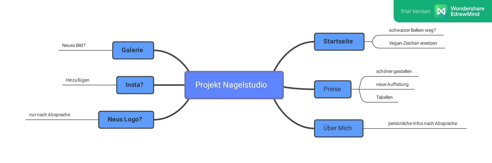

+++
title = "Bearbeitung einer Website von unserer Kundin"
date = "2021-08-31"
draft = false
pinned = false
tags = ["Nagelstudio"]
image = "nagelstudio-1-.png"
description = "Erster Kundenauftrag"
footnotes = "[nagelstudio-naguwerkstatt.ch](https://www.nagelstudio-naguwerkstatt.ch/)"
+++

Eine gute Freundin von **Leo** hat uns ihre **Nagelstudio-Website** anvertraut. Wir werden ein paar Veränderungen vornehmen. Sachen wie Preise, Fotos oder Rechtschreibfehler werden von uns angepasst. Natürlich nach den Wünschen von unseren Kundin. 

Nächste Woche geht es weiter...