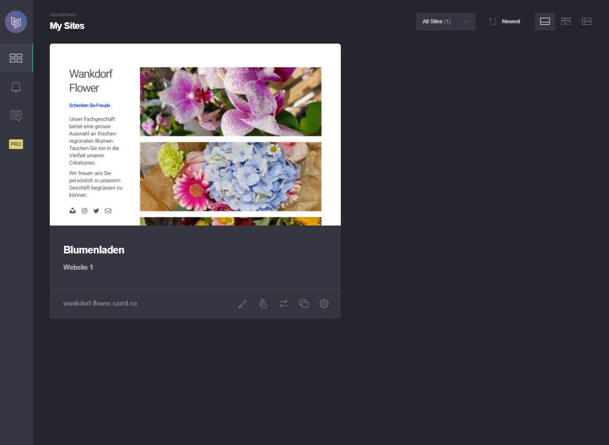

+++
title = "Erste Webseite für Blumenladen"
date = "2021-08-24"
draft = false
pinned = false
tags = ["Website"]
image = "n2jhyze2mjc2zjawyti0ytcwyty5mzjmogfjzjk1mti.jpg"
description = "In diesem Beitrag berichte ich über meine ersten Versuche eine Website zu erstellen."
+++

Letze Woche habe ich das erste Mal den Kurs WEB besucht. Ich habe mich von den Kursinhalten überraschen lassen und wusste nicht wirklich was auf mich zukommen wird.

Als erste Aufgabe haben wir in zweier Teams eine Webseite für einen fiktiven Blumenladen erstellt. Damit keine Bildrechte verletzt werden, haben wir unsere Bilder selber aufgenommen. 

Als alles wichtige erledigt war, haben wir mit der Hilfe von Carrd.co-Editor unsere Webseite gestaltet und veröffentlicht. Da ich noch nie eine Website gemacht habe war es etwas kompliziert. Nach ein paar kleineren Problemen hat dann alles tiptop geklappt. 

Am Ende der Lektion haben wir die Website vor der Klasse präsentiert.