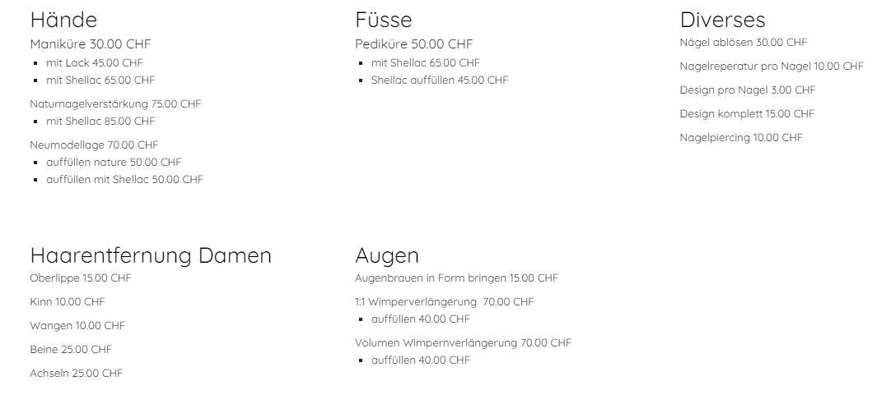

+++
title = "Programmieren + Fertigstellung Webseite Naguwärkstatt"
date = "2021-10-26"
draft = false
pinned = false
tags = ["programmieren", "done"]
image = "unbenannt.png"
description = "Endlich fertig!"
+++
Heute haben ich und Leo die Website von Linda fertiggestellt. Wir finden, dass die Website ein Glow-Up bekommen hat und richtig toll nun aussieht. 

Auch unserer Kundin Linda gefällt sie sehr. Die neuen Farben gefallen ihr sehr. Die Galerie ist nun auch auf dem neusten Stand. 

Für ihre Kunden sind neu die Preise viel deutlicher sichtbar und verständlich. 

